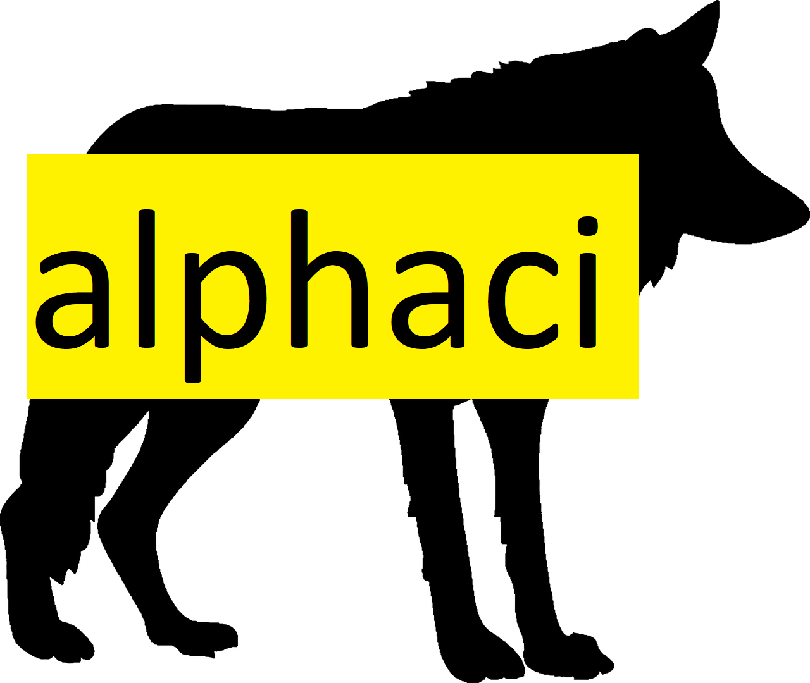

---
output:
  github_document:
    html_preview: true
---

<!-- README.md is generated from README.Rmd. Please edit that file -->

```{r, echo = FALSE}
knitr::opts_chunk$set(
  collapse = TRUE,
  comment = "#>",
  fig.path = "man/figures/README-"
)
```

```{r, include = FALSE, cache = TRUE}
library("alphaci")
set.seed(313)
model <- "A =~ A1+A2+A3+A4+A5; 
          C =~ C1+C2+C3+C4+C5"
n <- 200
object <- lavaan::sem(model, psych::bfi[1:n, 1:10], estimator = "MLM")
selector <- alphaci(object)
options(warn=-1)

```
# alphaci 

[](https://cran.r-project.org/package=alphaci)
[](https://github.com/JonasMoss/alphaci/actions)
[](https://www.repostatus.org/#active)
[](https://app.codecov.io/gh/JonasMoss/alphaci?branch=main)

An `R` package for doing inference with coefficient alpha and standardized 
alpha. Many methods are supported, with special emphasis on small samples
and non-normality.

```{r setup, include=FALSE}
#library("alphaci")
knitr::opts_chunk$set(echo = TRUE)
knitr::opts_chunk$set(out.width='750px', dpi=200)
```

## Installation
Use the following command from inside `R`:
```{r install, echo = TRUE, eval = FALSE}
# install.packages("remotes")
remotes::install_github("JonasMoss/alphaci")
```

## Usage
Call the `library` function and calculate the confidence interval.

```{r prepare, echo = TRUE, eval = TRUE}
library("alphaci")
library("psychTools")
x <- bfi[, 1:5]
x[, 1] <- -x[, 1] # Reverse-coded item.
alphaci(x)
```
## Supported techniques

`alphaci` supports three basic asymptotic confidence interval constructios. The
asymptotically distribution-free interval of Maydeu-Olivares et al. (2007), the
pseudo-elliptical construction of Yuan and Bentler (2002) for both general
models and parallel models. In addition, you may transform the intervals using
e.g. the Fisher transform. The option `bootstrap` does studentized 
bootstrapping and is recommended if the sample size is small. 


## References

## How to Contribute or Get Help
If you encounter a bug, have a feature request or need some help, open a [Github issue](https://github.com/JonasMoss/alphaci/issues). Create a pull requests to contribute. This project follows a [Contributor Code of Conduct](https://www.contributor-covenant.org/version/1/4/code-of-conduct.md).
