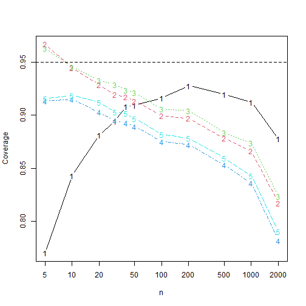

## Setting up the simulations

We use the dataset `bfi` from the package `psychTools` together with `lavaan`
to estimate some realistic factor loadings $\lambda$ and standard deviations
$\sigma$.


```r
model <- c("y =~ A1 + A2 + A3 + A4 + A5")
fit <- lavaan::cfa(model, data = psychTools::bfi)
coefs <- lavaan::lavInspect(fit, what = "x")
lambda <- abs(c(coefs$lambda * sqrt(as.numeric(coefs$psi))))
sigma <- sqrt(diag(lavaan::lavInspect(fit, what = "x")$theta))
```
We take the absolute value of the `lambda` vector as the agreement data
contains reverse-coded items.

## Comparing confidence intervals coverages and lengths
We compare five confidence intervals, all without transformations. The `adf`
interval is the asymptotic distribution-free interval, the `ell` interval
is the interval based on elliptical distributions and a kurtosis correction,
the `ell_par` is the elliptical interval assuming a parallel model. The same
comments hold for `norm` (assuming normal data) and `norm_par` (assuming
parallel normal data).


```r
library("alphaci")
library("future.apply")
plan(multisession)
set.seed(313)

n_reps <- 10000
k <- 5
latent <- \(n) extraDistr::rlaplace(n) / sqrt(2)
true <- alphaci:::alpha(sigma, lambda)
```

In this simulation we normal error terms and a Laplace-distributed latent
variable. This one has excess kurtosis $3$, which caries over in large part
to the data. `k` is the number of questions ands `n_reps` is the number of
simulations.


```r
success <- \(ci) true <= ci[2] & true >= ci[1]
len <- \(ci) ci[2] - ci[1]
simulations <- \(n) {
    results  <- future.apply::future_replicate(n_reps, {
      x <- alphaci:::simulate_congeneric(n, k, sigma, lambda, latent = latent)
      cis <- rbind(adf = alphaci(x),
        ell = alphaci(x, type = "elliptical"),
        par = alphaci(x, type = "elliptical", parallel = TRUE),
        norm = alphaci(x, type = "normal"),
        norm_par = alphaci(x, type = "normal", parallel = TRUE)
      )
      c(cov = apply(cis, 1, success), len = apply(cis, 1, len))
      }, future.seed = TRUE)
  rowMeans(results)
}
```

Let's check out the results when $n= 10$.

```r
simulations(10)
#>      cov.adf      cov.ell      cov.par     cov.norm cov.norm_par      len.adf      len.ell      len.par 
#>    0.8440000    0.9420000    0.9434000    0.9096000    0.9141000    0.6975007    0.9490424    1.0112209 
#>     len.norm len.norm_par 
#>    0.8412564    0.8998135
```
It appears  that the kurtosis corrections work well, at least for small sample
size. Let's see how they perform when $n$ increases.


```r
nn <- c(5, 10, 20, 30, 40, 50, 100, 200, 500, 1000, 2000)
results <- sapply(nn, simulations)
```

Plotting the coverages, we find, where `1` is asymptotically distribution-free, `2` is elliptical, `3`
is paralell and elliptical, `4` is `normal` and `5` is parallel and normal.

```r
matplot(nn, t(results[1:5, ]), xlab = "n", ylab = "Coverage", type = "b",
        log = "x")
abline(h = 0.95, lty = 2)
```



Hence the kurtosis correction intervals have better coverage than the `adf`
interval when $n\leq 50$ and outperforms the normal theory intervals for
all $n$. If this observation is general remains to be seen.
